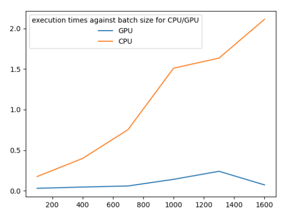

This code evaluates automatic and programmed parallelization on CPU and GPUs for an embeddings creation task by running movie title strings from the movielens_100K dataset through a transformer (all-MiniLM-L6-v2) model.

The experiment configurations are defined in parallelization_experiments.ini.

## Experiment 1
 Run the strings serially through a sentence transformer and direct embedding calculation and compare
 run times for different num_threads and batch sizes. First goal is to determine if direct embedding calculation using the transformer model and applying the same pooling and normalization technique produces the same results and is more or less efficient. 
 
The conclusion is that direct embedding calculation is about 20% more efficient. The results are identical to a very low tolerance. 

Second goal is to determine if parallelization is implemented internally in Pytorch by executing the forward pass on the transformer serially for each string and recording the execution time for varying number of threads. The number of threads is varied using `set_num_threads` function in Pytorch. Results are shown below.

The table below shows execution time of sentence transformer and direct calculation in sec for different batch sizes for num_threads = 1

num_threads=1
Batch Size\Execution Time | Sentence Transformer | Direct Calculation |
+---------------------------+----------------------+--------------------+
|            100            |         1.75         |        1.35        |
|            600            |        10.25         |        8.10        |
|            1100           |        18.95         |       14.90        |
|            1600           |        27.35         |       22.05        |
+---------------------------+----------------------+------------------

This table below shows the same results for num_threads = 10

num_threads=10
+---------------------------+----------------------+--------------------+
| Batch Size\Execution Time | Sentence Transformer | Direct Calculation |
+---------------------------+----------------------+--------------------+
|            100            |  1.022   | 0.59  |
|            600            |  5.66    | 3.55   |
|            1100           |  10.37   | 6.62  |
|            1600           |  15.177  | 9.50  |
+---------------------------+----------------------+--------------------+

The execution time is much lower for num_threads=10 than when num_threads=1, implying that there is tensor-level parallelism built into Pytorch. CPU utilization graph in the nmon utility validates this as well. 

## Experiment 2

The goal is to evaluate performance of batch execution on CPU and GPU. As expected, execution on GPU is significantly faster, and the execution time stays nearly flat as the batch size is increased, implying that available parallelism on the GPU is not fully utilized at these small batch sizes. Interestingly, batch execution on CPU is also almost 15x faster, suggesting that batching offers advantages on CPU also.

## Experiment 3

The goal is to investigate if distributing batch execution over multiple CPUs using Python multi-processing is effective in lowering execution time. The answer 

 num_proc
Execution time
1
1.95
2
1.68
3
3.17
4
3.94

